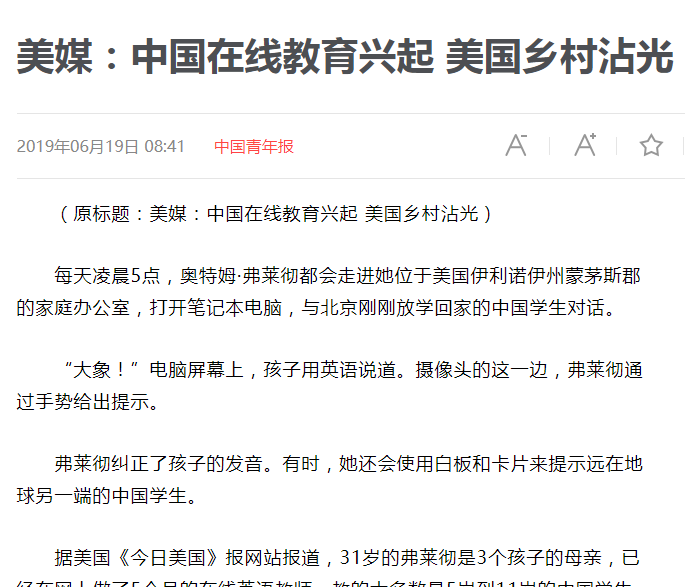

# scrapy_sina_new
项目是基于**scrapy**框架爬取新浪新闻全站的爬虫！！！

### 项目环境

1、环境准备

python3.6

Scrapy == 1.6.0

2、项目运行

打开一个cmd终端，切换到项目文件夹，运行以下代码

scrapy crawl sina 

3、项目结构

项目文件夹SinaNews

爬取结果文件夹 data

爬虫文件夹spiders

### 项目描述

该项目是基于scrapy框架爬取新浪新闻全站，爬取深度有三层，大标题---->小标题----->新闻内容，全程使用**xpath**匹配url，起始地址为`http://news.sina.com.cn/guide`,

1. 通过分析新闻大标题目录url，爬取该目录的新闻列表，并通过新闻列表爬取所有新闻，处理函数为parse
    **parse: 解析start_urls的内容，保存城市列表和url，并传递parse2每个城市url**

页面如下图：

2. parse2: 获取每个城市新闻的列表，并传递给parse3每一条新闻的url

​    

3. parse3：解析每条新闻的内容，保存新闻标题和内容

### 总结

只匹配了大部分的大标题，所有大标题不是统一的格式，故有的文件夹为空

